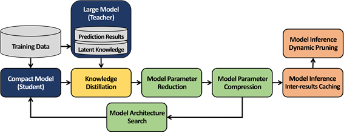

# PL-LOW
"PL-LOW" is short for "Pipeline for employing a Lightweight deep learning models for LOW-power systems"

# Features

## 1. Scalable and Efficient Learning

It manages dynamic data and models by using incremental learning. In other words, it efficiently reflects the data accumulated over time in the model at the previous time-stamp.

# Authors

#### Principal Investigator (PI)

- Professor Hwanjo Yu (hwanjoyu@postech.ac.kr)

#### Project Manager (PM)

- Ph.D Student Junsu Cho (junsu7463@postech.ac.kr)

# License

The code is licensed under the [MIT License]()
